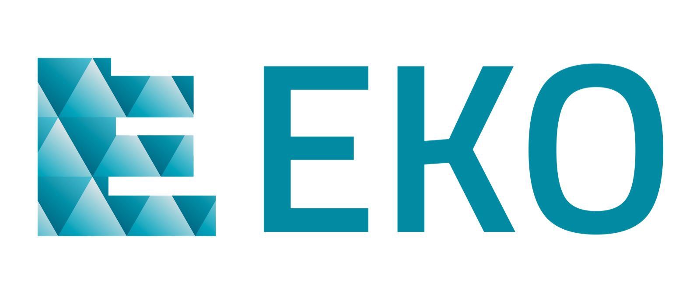

Welcome to EKO - EchoLink Project documentation
-----------------------------------------

EKO Blockchain Platform is a public blockchain service built on top of Proof of Professional Stake consensus protocol (PoPS). PoPS is designed for enterprise grade blockchain applications. The EKO Blockchain Platform is fully compatible with EVM based Solidity smart contracts, and offers some innovative features, such as confidential contracts. The EKO Blockchain Platform provides businesses and developers a fast and efficient way to develop and deploy blockchain applications.

EKO Careers is a blockchain based system that provides verified education, skill, and work experience information. Taking advantage of blockchain technology’s immutability and time stamp functionality, EKO Careers provides users with trusted information regarding a job candidate’s education, skill, and work experience. EKO Careers further acts as an international/cross border jobs/tasks marketplace with internationally recognized educational credentials and payments. EKO Careers is built on the EKO Blockchain Platform.

.. toctree::
   :maxdepth: 5
   :caption: Contents:

   introduction
   echolink_dapp
   echolink_tokenbridge
   authority_management
   eko_extension
   admin_interface
